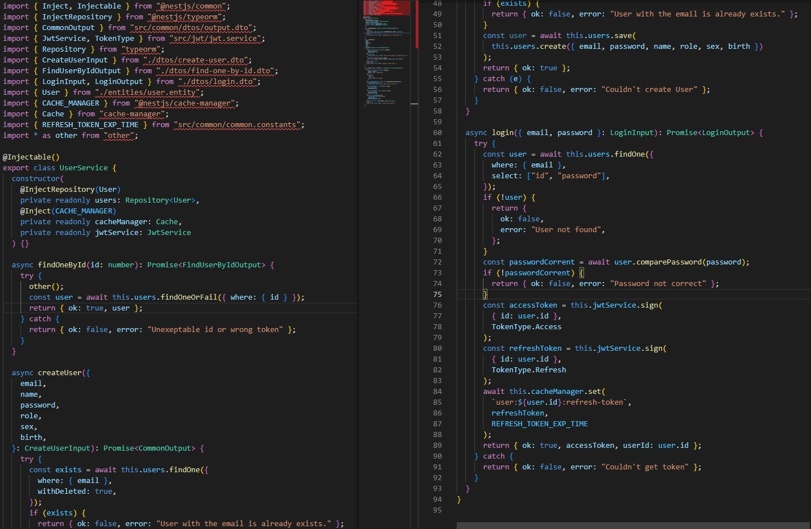
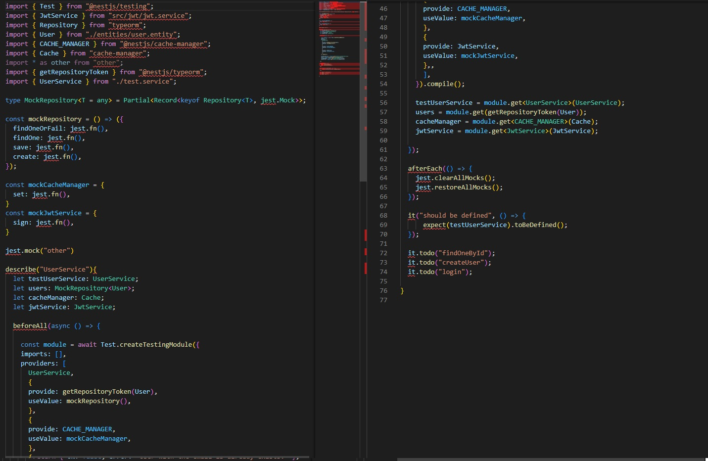

# NestJS-Test-Generator

An initail unit test file generator based on NestJS, jest.

It finds main test targets, mock targets, and dependency injection targets in the file and converts them to the test file format.

# What it does..

- finds main test target Class
- detects its dependency injections
- detects methods that main Class and dependencies using in file.
- detects all external import libraries used in a file.
- convert them into testing file.
  - dependencies are converted to mock provider/repository.
  - all external libraries are converted to mock library.
  - copy import declarations that should be in the test file.
  - the test target is not mocked.
  - make todos of all test target's methods.

# Usage

### Installation

run `npm i -g nestjs-test-gen`

### Basic Usage

run `nestjs-test-gen <options> <file-path>`

Currently there is only one option. `-s --suffix <suffix>`

This set suffix of output test file like: `service.<suffix>.ts`

Default is `spec > service.spec.ts`

# Preview

This is target file for `<filepath>`. The name is `user.service.ts`

Please ignore import errors. These files are copied just for preview. If your project uses nestJS and Testing Module, there will be no problem.

Below is generated initail test file. The name is `user.service.spec.ts`

